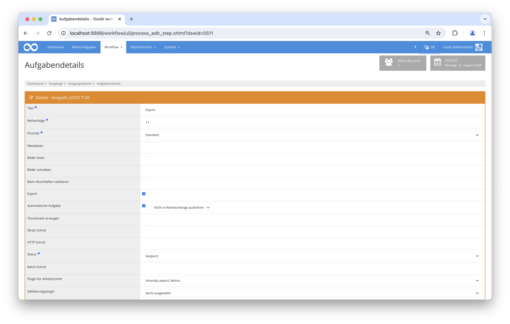

## Einführung
Die vorliegende Dokumentation beschreibt die Installation, die Konfiguration und den Einsatz des Fedora Export Plugins in Goobi workflow.


## Installation
Das Plugin muss in den folgenden Ordner installiert werden:



```bash
/opt/digiverso/goobi/plugins/export/plugin_intranda_export_fedora*.jar
```

Daneben gibt es eine Konfigurationsdatei, die an folgender Stelle liegen muss:

```bash
/opt/digiverso/goobi/config/intranda_export_fedora.xml
```


## Überblick und Funktionsweise
Es muss ein Export Schritt konfiguriert werden:

* Export DMS
* Automatische Aufgabe
* Plugin für Arbeitsschritt: FedoraExport

Bei der Ausführung des Schrittes wird ein Export des Goobi Vorgangs (analog zum Export ins Dateisystem) in das konfigurierte Fedora Repository unter Berücksichtigung der Konfiguration (siehe oben) eingespielt.

Die Daten des Vorgangs lassen sich anschließend über das folgende URL-Muster im Repository abrufen:

```bash
http(s)://<Fedora REST endpoint>/records/&lt;CatalogIdDigital>/
```


## Beispiele für die URLs nach erfolgreichem Ingest nach Fedora


### URL des Datensatzes

[http://localhost:8888/fedora/rest/records/PPN123456789/](http://localhost:8888/fedora/rest/records/PPN123456789/)


### URL für die METS-Datei

[http://localhost:8888/fedora/rest/records/PPN123456789/PPN123456789.xml](http://localhost:8888/fedora/rest/records/PPN123456789/PPN123456789.xml)


### URL für die Master-Bilder

[http://localhost:8888/fedora/rest/records/PPN123456789/master/master_00000001.tif](http://localhost:8888/fedora/rest/records/PPN123456789/master/master_00000001.tif) [http://localhost:8888/fedora/rest/records/PPN123456789/master/master_00000002.tif](http://localhost:8888/fedora/rest/records/PPN123456789/master/master_00000002.tif) [http://localhost:8888/fedora/rest/records/PPN123456789/master/master_00000003.tif](http://localhost:8888/fedora/rest/records/PPN123456789/master/master_00000003.tif)


### URL für die Derivate der Bilder

[http://localhost:8888/fedora/rest/records/PPN123456789/media/00000001.tif](http://localhost:8888/fedora/rest/records/PPN123456789/media/00000001.tif) [http://localhost:8888/fedora/rest/records/PPN123456789/media/00000002.tif](http://localhost:8888/fedora/rest/records/PPN123456789/media/00000002.tif) [http://localhost:8888/fedora/rest/records/PPN123456789/media/00000003.tif](http://localhost:8888/fedora/rest/records/PPN123456789/media/00000003.tif)


## Konfiguration
Die Konfiguration erfolgt über die Konfigurationsdatei `intranda_export_fedora.xml` und kann im laufenden Betrieb angepasst werden.

```xml
<config_plugin>

    <!-- fedoraUrl: REST endpoint of the target Fedora application. -->
    <fedoraUrl>http://localhost:8888/fedora/rest</fedoraUrl>

    <!-- useVersioning: If true, for each run of the export step, a new revision of the process will be created. Default is true. -->
    <useVersioning>true</useVersioning>

    <!-- ingestMasterImages: If true, master images of the Goobi process will be ingested into the container /master. Default is true. -->
    <ingestMasterImages>true</ingestMasterImages>

    <!-- ingestMediaImages: If true, derivate images of the Goobi process will be ingested into the container /media. Default is true. -->
    <ingestMediaImages>true</ingestMediaImages>

    <!-- ingestMetsFile: If true, a METS/MODS file will be generated and ingested. Default is true. -->
    <ingestMetsFile>true</ingestMetsFile>

    <!-- exportMetsFile: If true, the METS/MODS file will be exported into the given destination folder. Default is true. -->
    <exportMetsFile>true</exportMetsFile>

</config_plugin>
```

| Parameter | Erläuterung |
| :--- | :--- |
| `fedoraUrl` | REST Endpoint des Fedora Applikation |
| `useVersioning` | Wenn `true` gesetzt ist, wird die Revisionierung von Fedora verwendet. In diesem Fall wird für jeder Ausführung des Exportschrittes eine neue Revision des Vorgangs im Repository angelegt. Standardwert ist `true`. |
| `ingestMasterImages` | Wenn `true` gesetzt ist, werden die Master-Bilder des Vorgangs in den Subcontainer `/master` exportiert. Standardwert ist `true`. |
| `ingestMediaImages` | Wenn `true` gesetzt ist, werden die Derivate des Vorgangs in den Subcontainer `/media` exportiert. Standardwert ist `true`. |
| `ingestMetsFile` | Wenn `true` gesetzt ist, eine METS/MODS Datei erzeugt und im Container exportiert. Standardwert ist `true`. |
| `exportMetsFile` | Wenn `true` gesetzt ist, eine METS/MODS Datei erzeugt und in den üblichen Export-Ordner (z.B. `/hotfolder`) geschrieben. Standardwert ist `true`. |
